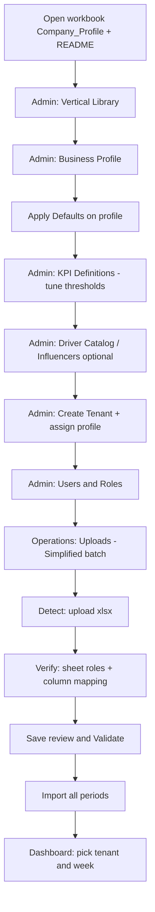

# Decision OS Distribution — Setup, KPIs, and Simplified Import Review

**Audience:** Admins and operators onboarding a **distributor** (tenant), configuring standards, and importing a multi-tab Excel workbook.

**Related guide:** `_client_docs/DecisionOS_Distribution_User_Guide.md` (full screen-by-screen UI reference).

**Format:** Markdown (open in Word: *File → Open*, or *Save As → .docx*).

---

## 1. Concepts (read first)

| Term | In the system | How it is created |
|------|---------------|-------------------|
| **Distributor / client company** | **Tenant** (`ClientId`, `Name`, `BusinessProfileId`) | **Admin → Tenants** — one per onboarded distributor |
| **Buyer / end customer** | `Customer_ID` / `Customer_Name` on import rows | **Import only** — no Admin “Create Customer” screen |
| **Reporting week** | `PeriodEnd` (week-ending date) | Created when simplified/classic import runs |
| **Industry template** | **Vertical Library** | **Admin → Vertical Libraries** |
| **KPI/driver standards for a business type** | **Business Profile** | **Admin → Business Profiles** |
| **Company-specific tweaks** | **Tenant KPI/Driver overrides** | **Admin → Tenants → Overrides** |

**Seven dashboard KPI codes (do not invent others without checking Admin):**

`GrossMargin%` · `AR_PastDue31p%` · `AP_PastDue31p%` · `DOH` · `CCC` · `NetProfit%` · `PerfectOrderRate`

---

## 2. End-to-end flow

**Rule:** Admin setup does **not** load weekly numbers. Only **import** writes sales, inventory, AR/AP, KPI snapshots, drivers, and alerts.

---

## 3. Admin setup — what to fill (in order)

### Step 1 — Vertical Libraries (`/Admin/VerticalLibraries`)

**Purpose:** Category label for business profiles (e.g. general **Distribution**).

| Field | What to enter |
|-------|----------------|
| **Code** | Short unique code, e.g. `DISTRIBUTION` |
| **Name** | Display name, e.g. `Distribution` |
| **Description** | Optional program notes |
| **Active** | On for new verticals |

Usually **confirm an existing vertical** rather than creating many.

---

### Step 2 — Business Profile (`/Admin/Profiles` → Add Profile)

**Purpose:** Defines which **KPI definitions**, **drivers**, and **influencers** apply to distributors of this business type. Tenants **link** to one profile.

| Field | What to enter | Source (workbook) |
|-------|----------------|-------------------|
| **Code** | Unique profile code you assign, e.g. `TERRYS_PLUMBING_DIST`, `DST_002` | Not auto-imported |
| **Name** | Label, e.g. `Plumbing supply distributor` | **Business Type** or derived from **Company Name** |
| **Description** | Free text: systems, scope, sales band | **Company_Profile**, **README_Import_Map** |
| **Vertical** | Select from Vertical Libraries | Your program vertical |
| **Location structure** | Optional, e.g. warehouse notes | README / Company_Profile |
| **Channel structure** | Optional, e.g. `Outside customers only` | **Customer Scope** |
| **Active KPI profile code** | Optional metadata, e.g. `PILOT_7` | Program convention |
| **Threshold profile code** | Optional, e.g. `PILOT_DEFAULT` | Program convention |
| **Active** | Checked | — |

**After save:** open the profile → **Defaults** → **Apply Defaults**

- Copies **global** KPI definitions and driver catalog into this profile (adds missing rows only; does not overwrite existing profile rows).
- Run once per new profile before assigning tenants.

---

### Step 3 — KPI Definitions (`/Admin/KpiDefinitions`)

**Purpose:** Targets and red/amber/green thresholds for each KPI **code**. Can be **global** (`BusinessProfileId` empty) or **profile-scoped** (filter by profile from Business Profiles → KPIs link).

| Field | What to enter |
|-------|----------------|
| **Code** | One of the seven codes above |
| **Name** | Display name |
| **Unit** | Usually `%` or `days` |
| **Direction** | Higher-is-better vs lower-is-better |
| **Target** | Decimal, e.g. `0.30` for 30% gross margin |
| **Amber / Red** | Threshold bands |
| **Recommended action** | Text shown on dashboard |

**Workbook cross-check:** Tab **`KPI_Targets_Expected`** (or `DPOS_KPI_Expected`) lists expected R/Y/G — use it to **tune thresholds** after import; V1 does **not** auto-apply that tab to snapshots.

**Example (Terry / pilot):** **Target Gross Margin** `0.29` or `29%` → KPI **`GrossMargin%`** → Target **`0.29`**.

**Delete:** Admin can delete KPI definitions where the UI allows (duplicate code prevention on create).

---

### Step 4 — Driver Catalog (`/Admin/DriverDefinitions`)

**Purpose:** Pillar-level **drivers** ranked on the dashboard (holdovers, improvement actions). Global or profile-scoped (same pattern as KPIs).

| Field | What to enter |
|-------|----------------|
| **Pillar code** | Links to KPI area, e.g. margin, AR, inventory |
| **Driver code** | Stable key |
| **Display name** | Operator-facing label |
| **Sort order** | Display order |
| **Active** | On/off |

Populated for a new profile via **Apply Defaults**. Edit per profile if needed.

**Workbook:** **`Holdover_Actions`** (simplified import) loads driver-style rows for the dashboard holdover table.

---

### Step 5 — Influencers (`/Admin/Influencers`)

**Purpose:** Optional **micro-drivers** under a pillar + driver (weighted factors). **Always profile-scoped** — select a **Business Profile** on the index page first.

| Field | What to enter |
|-------|----------------|
| **Business Profile** | Required context on list page |
| **Pillar code** | Parent pillar |
| **Driver code** | Parent driver from catalog |
| **Code / Name** | Influencer identity |
| **Direction / Weight** | Impact modeling |
| **Active** | On/off |

**Not imported from Excel in V1.** Configure in Admin when your program uses influencer logic; otherwise skip after Apply Defaults.

---

### Step 6 — Tenant (`/Admin/Tenants` → Add Tenant)

**Purpose:** The **distributor** account used in Uploads and Dashboard.

| Field | What to enter | Source |
|-------|----------------|--------|
| **Client ID** | Stable key, e.g. `TERRYS-001`, `DIST-001` | You define; must match operator selection in Uploads |
| **Name** | Legal/display company name | **Company_Profile → Company Name** |
| **Archetype** | Short label (optional) | **Business Type** |
| **Business profile** | Profile from Step 2 | Required for profile-specific KPIs/drivers |

**Overrides (optional):**

- **KPI overrides** — tenant-specific target/threshold overrides per KPI code.
- **Driver overrides** — force active/inactive or rename drivers for one tenant.

**Do not** create a new tenant per end customer/buyer.

---

### Step 7 — Users & Roles (`/Admin/Users`)

| Role | Typical access |
|------|----------------|
| **Admin** | All Admin + Operations + Dashboard |
| **Operator** | Uploads, Import History, Dashboard |
| **Viewer** | Dashboard only |
| **Developer** | Operations + Dashboard |

---

## 4. Company_Profile workbook tab → Admin (cheat sheet)

The **`Company_Profile`** sheet is **not imported** in V1. Copy values into Admin.

| Company_Profile field | Admin destination |
|----------------------|-------------------|
| Company Name | Tenant → **Name** |
| *(you define)* | Tenant → **Client ID** |
| Business Type | Profile **Name** / **Description**; Tenant **Archetype** |
| Customer Scope | Profile **Channel structure** / **Description** |
| POS / Accounting System | Profile **Description** |
| Week Ending Day | Simplified upload **Anchor** = a date on that weekday (e.g. Saturday) |
| Target Gross Margin | KPI **`GrossMargin%`** → **Target** (decimal) |
| Expected KPI Mix | Compare after import only |
| KPI_Targets_Expected tab | Validation reference; set Role **Skip** on import review |

---

## 5. Simplified import — operations flow

| Step | Route | Action |
|------|-------|--------|
| 1 | `/Operations/Uploads/Create` | Mode **Simplified**, select **Tenant**, **Anchor** (first week-ending to include), **Cadence** Weekly |
| 2 | `/Operations/Uploads/Simplified/Detect?id=…` | Upload `.xlsx` → **Analyze workbook** |
| 3 | `/Operations/Uploads/Simplified/Verify?id=…` | **Import review** (sheet roles, column mapping, KPI coverage) |
| 4 | Same | **Save review & re-validate** |
| 5 | Same | **Validate package** |
| 6 | Same | **Import all periods** (confirm if gray KPIs) |
| 7 | `/Dashboard` | Same **Client ID**, pick **reporting week** |

---

## 6. Import review — sheet role (Excel tab → table type)

**Screen:** Verify → **Sheet roles (override classification)**

Each Excel **tab** gets a **Role** (`WorkbookSheetKind`). That chooses which **system fields** appear in column mapping and which import path runs.

| Role | Meaning | Use for |
|------|---------|---------|
| **WeeklyRollup** | One row per week-ending; feeds KPI math | `Weekly_Financials`, `AR_Aging`, `AP_Aging` (rollup-style tabs) |
| **Sales** | Line-level sales | `Sales_By_SKU_Week`, transactional sales |
| **Inventory** | Inventory snapshots | SKU/location inventory tabs |
| **AccountsReceivable** | AR open-item detail | Classic AR tabs (if not rollup) |
| **AccountsPayable** | AP open-item detail | Classic AP tabs |
| **Customer** | Customer master / sales+AR summary | `Customer_Sales_AR` (Terry pack) |
| **Vendor** | Vendor master or performance | `Vendor_Performance` |
| **Holdover** | Improvement actions | `Holdover_Actions` |
| **CompanyProfile** | Field/value company tab | Reference — prefer **Skip** |
| **ExpectedKpiValidation** | Expected KPI outcomes tab | Reference only — set **Skip** |
| **Skip** | Do not import | README, tests, notes, `KPI_TARGETS_EXPECTED` |
| **Unknown** | Auto-detection failed | Operator must pick a role or **Skip** |

**Important:** Role alone is not enough. Wrong role → wrong or gray KPIs.

---

## 7. Import review — column mapping (Excel header → system field)

**Screen:** Verify → **Edit mappings** on a sheet row.

- **Left:** Excel **header** exactly as in the file.
- **Right:** **System field** the importer understands, or **Ignore**.

Mapping options depend on **Role**:

### WeeklyRollup — common system fields

| System field | Typical Excel headers |
|--------------|----------------------|
| `Period_End_Date` | `Week_Ending`, `Period_End`, week-ending date |
| `Net_Sales` | `Net_Sales`, revenue |
| `COGS` | `COGS`, cost of goods sold |
| `Gross_Margin_Percent` | `Gross_Margin_%`, margin ratio (0–1 or 0–100) |
| `Inventory_Value` | Total inventory $ |
| `AR_Over_60_Pct` | Only if column is a **ratio** — prefer bucket math (below) |
| `AP_Past_Due_Pct` | Only if column is a **ratio** |
| `Net_Profit_Percent` / `Net_Income` | Operating profit % or net income |
| `Fill_Rate_Pct` | Vendor fill rate (often on vendor tab) |
| `Ignore` | Narrative / unused columns |

**Do not map dollar aging buckets** (e.g. `AR_Over_90` = `288000`) to **`AR_Over_60_Pct`** — that produces bogus “percent” KPIs. Leave unmapped or **Ignore**; the importer can compute AR % from bucket columns when role is **WeeklyRollup**.

### Vendor role

Vendor identity fields plus **`Fill_Rate_Pct`** for **PerfectOrderRate**.

### Sales / Inventory / AR / AP / Customer

Full field lists match **Classic** map screens (`SystemFields` in app). Map period/date, amounts, IDs, and balances as appropriate.

### Reference-only sheets (`KPI_TARGETS_EXPECTED`, README, etc.)

The UI explains: **no operational mapping**. Set role **Skip**; columns are not loaded into KPI tables.

---

## 8. Import review — other Verify sections

| Section | Purpose |
|---------|---------|
| **KPI coverage (before import)** | Per KPI: Ready / Missing (expect GRAY) / Depends on other — use **Suggested fix** links |
| **Periods to import** | Checkboxes to **exclude** specific week-ending dates |
| **Detection warnings** | Analyzer notes (anchor adjusted, weak detection, etc.) |
| **Readiness** | After **Save review** and **Validate package** |
| **Re-detect periods** | Change **Anchor** and re-run detection |

**Buttons (order):**

1. Adjust roles/mappings → **Save review & re-validate**
2. **Validate package**
3. **Import all periods** (checkbox to acknowledge gray KPIs if needed)

**Auto-create KPI:** If the workbook maps a rollup column to a KPI code not in the database, V1 can **add a KPI definition** on save/import (workbook-driven codes only when mapped).

---

## 9. Recommended sheet roles — Terry Plumbing Add-On pack (example)

| Excel tab | Recommended role | Column mapping notes |
|-----------|------------------|----------------------|
| `README` | **Skip** | — |
| `Company_Profile` | **Skip** (or CompanyProfile) | Admin setup only |
| `Weekly_Financials` | **WeeklyRollup** | Map week, `Net_Sales`, `COGS`, `Inventory_Value`, profit fields |
| `AR_Aging` | **WeeklyRollup** | Map week; bucket columns — do not map `AR_Total` to percent fields |
| `AP_Aging` | **WeeklyRollup** | Vendor rows OK; AP % aggregated per week |
| `Vendor_Performance` | **WeeklyRollup** or **Vendor** | `Fill_Rate` → `Fill_Rate_Pct` |
| `Customer_Sales_AR` | **Customer** | Not **Sales** |
| `Operating_Expenses` | **Skip** | Not AP operational detail |
| `KPI_TARGETS_EXPECTED` | **Skip** | Expected outcomes for manual validation only |
| Test / notes tabs | **Skip** | — |

---

## 10. Recommended sheet roles — Steve’s Bowling pilot (SKU-level pack)

| Excel tab | Recommended role |
|-----------|------------------|
| `Weekly_Financials` | **WeeklyRollup** |
| `Sales_By_SKU_Week` | **Sales** |
| AR / AP / Inventory detail | **AccountsReceivable** / **AccountsPayable** / **Inventory** |
| `Holdover_Actions` | **Holdover** |
| `Customer_Master` | Detected; buyers still come from sales/AR rows in V1 |
| `README_Import_Map`, `KPI_Targets_Expected`, `Source_Notes` | **Skip** or reference |

---

## 11. What import writes vs what Admin configures

| Data | Admin setup | Simplified import |
|------|-------------|-------------------|
| Tenant identity | Yes | Selects tenant only |
| KPI thresholds | Yes | Computes **status** from thresholds + values |
| Weekly KPI values | No | Yes → `KpiSnapshots` |
| Drivers / holdovers | Catalog in Admin | Yes from **Holdover** + scoring |
| Influencers | Admin only | Not from Excel in V1 |
| End customers | No | From **Customer** / **Sales** / **AR** columns |
| Company_Profile tab | Manual copy | Not persisted in V1 |

---

## 12. After import — validation checklist

1. **Dashboard** → tenant **Client ID** → week from dropdown (usually **Saturday** week-ending for pilot files).
2. SQL or UI: seven KPIs should not all be **GRAY** with value `0` if rollup data exists.
3. Compare colors to **`KPI_Targets_Expected`** tab (manual).
4. **Import History** — run completed, row counts reasonable.
5. If AR/AP % look like thousands, re-open **Verify** → fix column maps → **Save review** → re-import.

---

## 13. Troubleshooting import review

| Problem | What to check |
|---------|----------------|
| All KPIs GRAY | Weekly_Financials role **WeeklyRollup**; `COGS` + `Period_End_Date` mapped; re-import |
| AR/AP % in thousands | Dollar column mapped to percent field; use bucket columns or Ignore |
| Column dropdown only **Ignore** | Sheet is reference-only (`KPI_TARGETS_EXPECTED`) — set **Skip**, map other tabs |
| Save review wiped mappings | Re-open **Edit mappings** on data tabs; **Save review** again (server merges/auto-infers) |
| Unknown on many sheets | Set roles manually per tables above |
| No weeks on dashboard | Wrong anchor; re-detect; or no sales/rollup dates |

---

## 14. Admin menu quick reference

| Menu item | Route | Role in setup |
|-----------|-------|----------------|
| Vertical Libraries | `/Admin/VerticalLibraries` | Industry category |
| Business Profiles | `/Admin/Profiles` | KPI/driver standards + Apply Defaults |
| Tenants | `/Admin/Tenants` | Distributor onboarding |
| KPI Definitions | `/Admin/KpiDefinitions` | Thresholds and targets |
| Driver Catalog | `/Admin/DriverDefinitions` | Dashboard drivers |
| Influencers | `/Admin/Influencers` | Optional micro-drivers (per profile) |
| Users & Roles | `/Admin/Users` | Access control |
| Import History | `/Operations/ImportRuns` | Audit |
| Uploads | `/Operations/Uploads` | Simplified / Classic batches |

---

*Document version: aligns with DecisionOS Distribution V1 simplified **Import review** (sheet roles + column mapping UI). Verify in repo: `Pages/Operations/Uploads/Simplified/Verify.cshtml`, `WorkbookReviewFieldCatalog.cs`, `SimplifiedWorkbookReviewService.cs`.*
